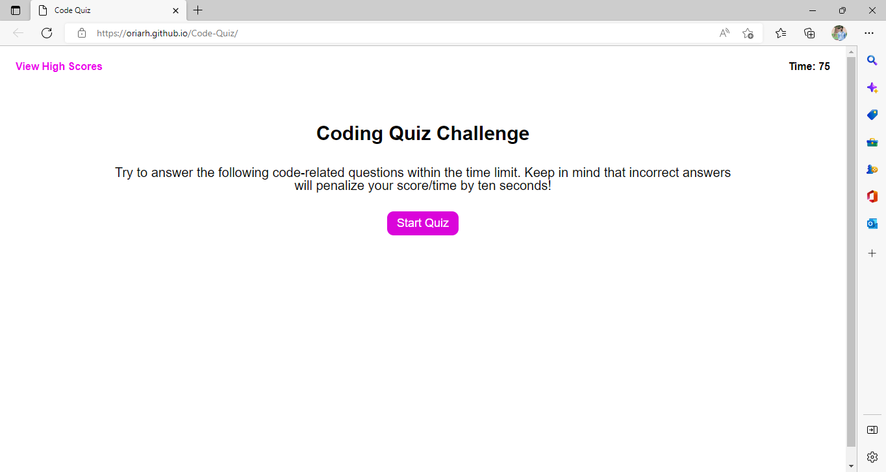

# Code-Quiz

## Descriptions 
This quiz web application allows candidates to prepare for interview quizes.
It contains MCQs and is timed. 

## URL
https://oriarh.github.io/Code-Quiz/

## Screenshot

## Installation
N/A

## Usage
When you open the URL provided above, it takes you to the main page where you get the instructions and the a button to start the quiz.

When the button is clicked, it takes you to the questions and the timer starts. 

Every wrong answer leads to a 10 second panelty from the timer.

When the timer goes to zero, the quiz ends. It also tells you if the answer selected by you was correct or wrong.

This web app was built using HTML and CSS & Javascript.

## Credits
UC Berkeley Extension Instructional Staff

## License
MIT License
